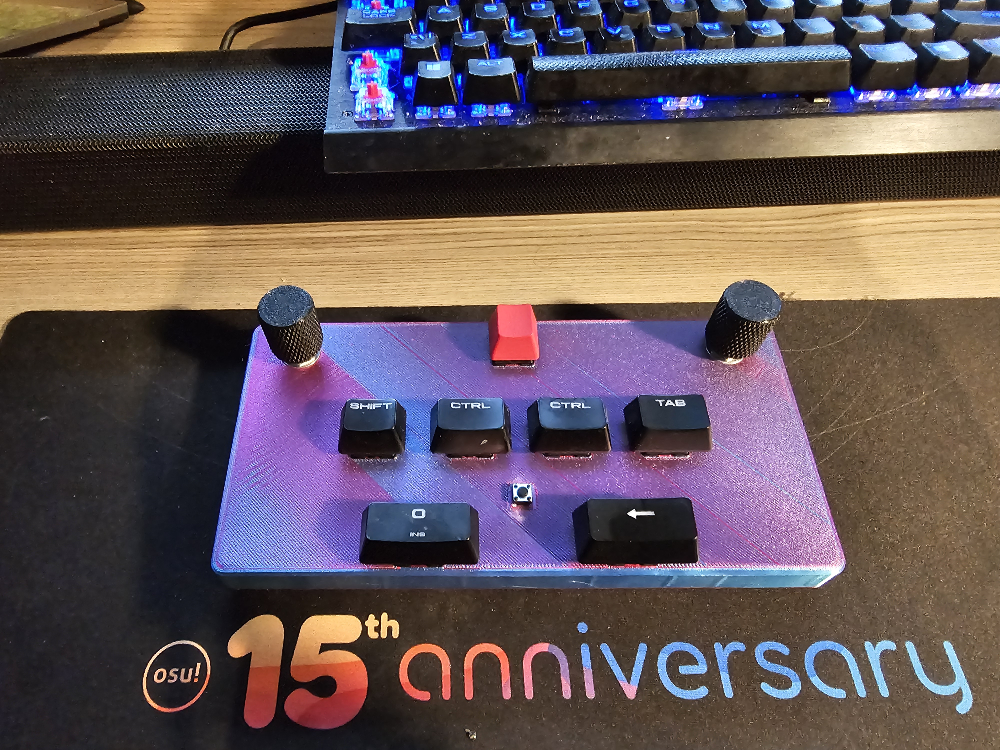

# Scuffed SDVX Controller

Scuffed SDVX Controller based on speedypotato's Pocket SDVX Pico.

# Firmware

It is using Firmware from speedypotato (v20220705 Pocket SDVX Pico v4) which can be found here: https://github.com/speedypotato/Pico-Game-Controller/releases

About 1kg of lead was added to controller.

# Parts Used

Microcontroller: 1x Raspberry Pi Pico

Encoders: 2x Bourns PEC16-4220F-N0024 (Would recommend PEC16-4015F-N0024 as they don't have detents)

Switches: 6x Cherry MX Brown (Just use any switch you like)

Back button: 1x Some random button i had.

# Wiring

